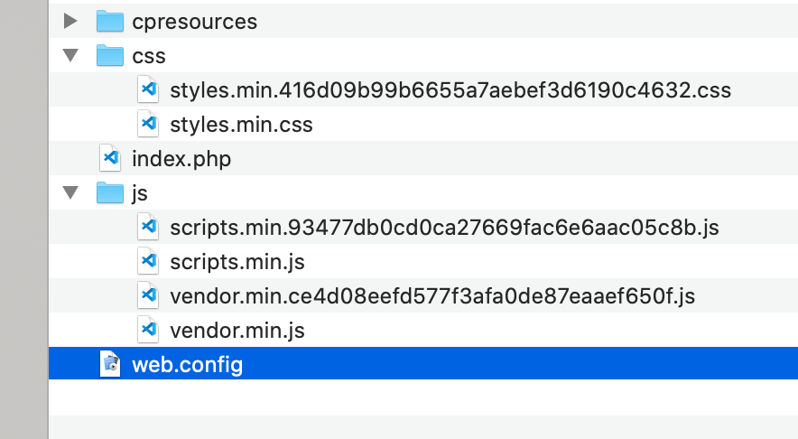
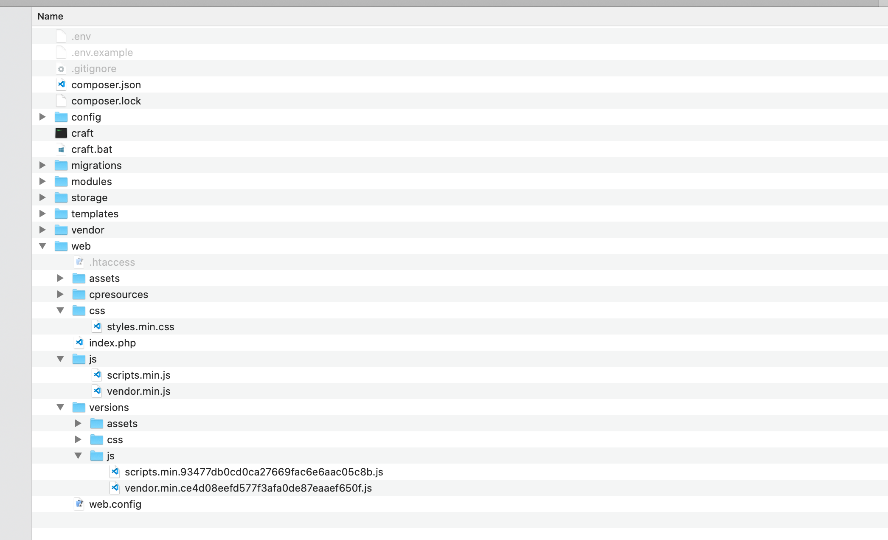

# Asset Versioner plugin for Craft CMS 3.x

Automatically generate unique hashed versions of static files and assets for efficient and reliable browser caching


## Requirements

- Craft CMS 3 or later on Linux or MacOS (untested on Windows as of yet)

## Installation

To install the plugin, follow these instructions.

1. Open your terminal and go to your Craft project:

   ```sh
   $ cd /path/to/project
   ```

2. Then tell Composer to load the plugin:

   ```sh
   $ composer require weareferal/asset-versioner
   ```

3. In the Control Panel, go to Settings → Plugins and click the *Install* button for Asset Versioner.

## Overview

This plugin automatically generates cache-busting versioned file names for both the static files within your webroot (JS, CSS, fonts etc.) as well as uploaded volume assets.




## Reasoning

"Versioning" your files is a great way to avoid having caching issues when serving your site. Without it it's possible that visitors to your site may see old out-of-date versions of your files (CSS, JS etc.) that have come from their browser cache.

Usually versioning is simply the process of appending a md5 hash of a file to the end of its filename:

> /js/scripts.min.js > /js/scripts.min.93477db0cd0ca27669fac6e6aac05c8b.js

With this approach, there's no way of ever being served an out-of-date version of the file, as its content is reflected in the md5 hash within the filename itself. 

There are numerous existing approach to creating unique "versioned" files, but they largely involve handling the versioning yourself within your front-end JavaScript build pipeline. This is error prone and requires oversight. Furthermore that only handles your static files, not your uploaded Craft asset files.

Asset Versioner aims to handle both of these cicumstances automatically and without any need for oversight.

## Usage

As mentioned above, there are two circumstances Asset Versioner handles:

### Static Files

There are a few ways to automatically generate your versioned static files:

- Run the command line script via `./craft asset-versioner/scan/index`. You can automate this via Cron or your deployment script (for example in Forge)
- Use the Utilities page to manually run the scan

Either way, Asset Versioner will automatically search for all files in your webroot that match the extensions you are interested versioning (these extensions can be controlled via the settings). It will automatically exclude the `cpresources` folder plus any volumes in your webroot so as not to duplicate versioned files or rename anything else unessessarily.

You can then use the `version` Twig filter in your HTML files which will automatically replace the relative string to the file with the versioned file:

```html
<script type="text/javascript" src="{{ '/js/scripts.min.js' | version }}"></script>
```

will generate:

```html
<script type="text/javascript" src="/js/scripts.min.93477db0cd0ca27669fac6e6aac05c8b.js"></script>
```

Behind the scense Asset Versioned manages a keystore in the cache of all files that have been versioned. This means that this lookup shouldn't negatively affect performance

### Asset Files

Files that are uploaded to Craft's volumes will be automatically versioned meaning you don't have to do anything at all for this to work.

## Caveats

Currently, this plugin only works with local files in you filesystem's webroot. 

## Roadmap

- Add support for non-local volumes
- Add ability to select folders
- Add ability to control extensions

Brought to you by [Feral](https://weareferal.com)
