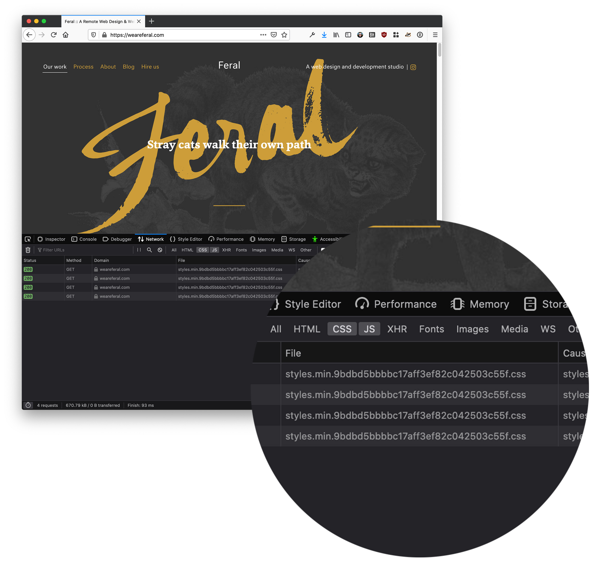

# Asset Versioner


Automatically generate unique hashed versions of static files and assets for efficient and reliable browser caching.

## Overview



This plugin automatically generates cache-busting hashed versions for both the static files within your webroot (JS, CSS, fonts etc.) as well as uploaded volume assets.

Unlike other approaches, this means you don't have to handle anything as part of your development workflow (for example, using Gulp to create the hashed files, or maintaining a manifest file).

For static files, it does this by creating a `scan` command that you can run on every deployment:

```sh
./craft asset-versioner/scan
```

This command searches for static files within your webroot and creates hashed versions alongside. It then saves the reference in a keystore that is accessed via a twig template filter:

```twig
<link rel="stylesheet" href="{{ '/css/styles.min.css' | version }}" type="text/css" charset="utf-8">

<!-- This renders something like -->

<link rel="stylesheet" href="/versions/css/styles.min.f42a3a61335bbb10fbcecbab39b42772.css" type="text/css" charset="utf-8">
```

For asset files, the versioning happens automatically when a new file is uploaded, meaning you don't have to do anything at all to get versioning for free.

## Background

"Versioning" your files is a great way to avoid having caching issues when serving your site. Without it it's possible that visitors to your site may see old out-of-date versions of your files (CSS, JS etc.) that have come from their browser cache.

Usually versioning is simply the process of appending a md5 hash of a file to the end of its filename:

> /js/scripts.min.js > /js/scripts.min.93477db0cd0ca27669fac6e6aac05c8b.js

With this approach, there's no way of ever being served an out-of-date version of the file, as its content is reflected in the md5 hash within the filename itself.

There are numerous existing approach to creating unique "versioned" files, but they largely involve handling the versioning yourself within your front-end JavaScript build pipeline. This is error prone and requires oversight. Furthermore this only handles your static files, not your uploaded Craft *asset* files.

Asset Versioner aims to handle both of these cicumstances automatically.

## Requirements

This plugin requires Craft CMS 3.0.0 or later.

## Installation

To install the plugin, follow these instructions.

1. Open your terminal and go to your Craft project:

   ```sh
   $ cd /path/to/project
   ```

2. Then tell Composer to load the plugin:

   ```sh
   $ composer require weareferal/asset-versioner
   ```

3. In the Control Panel, go to Settings → Plugins and click the *Install* button for Asset Versioner.

## Configuration

Configuration is handled solely via a `config/asset-versioner.php` file. This is because asset versioning is almost always something you only want to do on your *production* instance and not on development or staging.

By default, all asset versioning is disabled, so you need to enable it for the environments you are interested in.

You can copy the `config.php` example from the repo. Here is an example:

```php
<?php

return [
    '*' => [
        'staticVersioningEnabled' => false,
        'assetVersioningEnabled' => false,
    ],
    'production' => [
        // Whether or not to enable versioning for static files specifically. 
        // Static files are the JS, CSS, png, jpeg, fonts ... that you use
        // part of your development workflow
        'staticVersioningEnabled' => true,

        // The extensions of the static files you are interested in being
        // hashed. In this example, we are only hashing JS & CSS files
        'staticVersioningExtensions' => 'css,js',

        // The name of the folder within your webroot to storge copied, versioned
        // files. This makes it easy to add this folder to your gitignore so that
        // generated version files are not in your repo.
        'staticVersioningPrefix' => 'versions',

        // Whether or not to enable versioning for uploaded Craft asset files.
        // This may or may not be something you need.
        'assetVersioningEnabled' => true,

        // The extensions of the asset files you are interested in being hashed.
        'assetVersioningExtensions' => 'png,jpg,jpeg,pdf'
    ]
];
```

## Usage

As mentioned above, there are two circumstances Asset Versioner handles:

### Static Files

To generate versioned asset files, run the command:

```sh
./craft asset-versioner/scan
```

On your local/staging/production machine. You can automate this via Cron or your deployment script (for example in Forge).

This command will automatically search for all files in your webroot that match the extensions you are interested versioning (these extensions can be controlled via the `staticVersioningExtensions` settings). It will automatically exclude the `cpresources` folder plus any volumes in your webroot so as not to duplicate versioned files or rename anything else unessessarily.

The files that it finds will be md5 hashed and that hash value will be appended to their filename, before the extension. These files will be saved within a `versions` folder within your webroot. You should therefore add this folder to your `.gitignore`:

```gitignore
...
web/versions
```

You then use the `version` Twig filter in your HTML files which will automatically replace the relative string to the file with the versioned file:

```html
<script type="text/javascript" src="{{ '/js/scripts.min.js' | version }}"></script>
```

will generate:

```html
<script type="text/javascript" src="/js/scripts.min.93477db0cd0ca27669fac6e6aac05c8b.js"></script>
```

Behind the scenes the plugin manages a keystore in the Yii cache of all files that have been versioned. This means that this lookup and mapping of original file to versioned file won't negatively affect performance.

### Asset Files

Files that are uploaded to Craft's volumes will be automatically versioned meaning you don't have to do anything at all for this to work.

## Caveats

### Relative paths to non-versioned files

Remember that all versioned assets are stored in a `versions` folder within you webroot. This means that if you have any relative paths to files that _aren't_ versioned, then they will most likely cause 404s in production as the relative path is no longer correct.

If you have a CSS file that is versioned but references a non-versioned font file like so:

```css
@font-face {
    font-family: 'Font';
    src: url('../fonts/Font.eot');
    src: url('../fonts/Font.eot?#iefix') format('embedded-opentype'),
        url('../fonts/Font.woff2') format('woff2'),
        url('../fonts/Font.woff') format('woff'),
        url('../fonts/Font.ttf') format('truetype');
    font-weight: normal;
    font-style: italic;
}
```

You will need to change it to an absolute path or you will get 404s:

```css
@font-face {
    font-family: 'Font';
    src: url('/fonts/Font.eot');
    src: url('/fonts/Font.eot?#iefix') format('embedded-opentype'),
        url('/fonts/Font.woff2') format('woff2'),
        url('/fonts/Font.woff') format('woff'),
        url('/fonts/Font.ttf') format('truetype');
    font-weight: normal;
    font-style: italic;
}
```

### Local files

Currently, this plugin only works with local files in you filesystem's webroot.

### Sourcemaps

Currently these won't work with versioning enabled. See for more:

https://github.com/weareferal/craft-asset-versioner/issues/3

## Support


Brought to you by [Feral](https://weareferal.com). Any problems email [timmy@weareferal.com](mailto:timmy@weareferal.com?subject=Craft%20Env%20Sync%20Question) or leave an issue on Github.